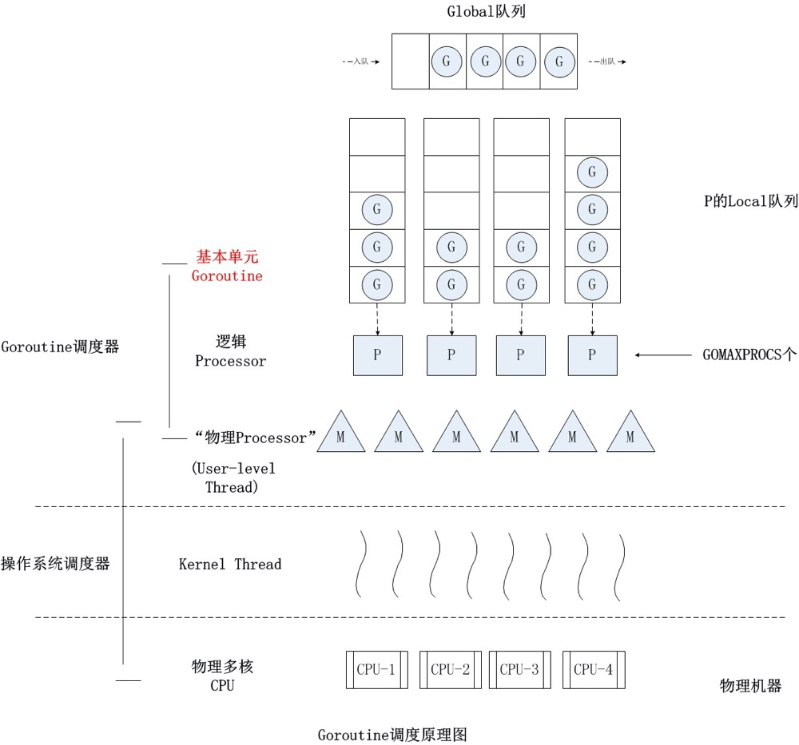
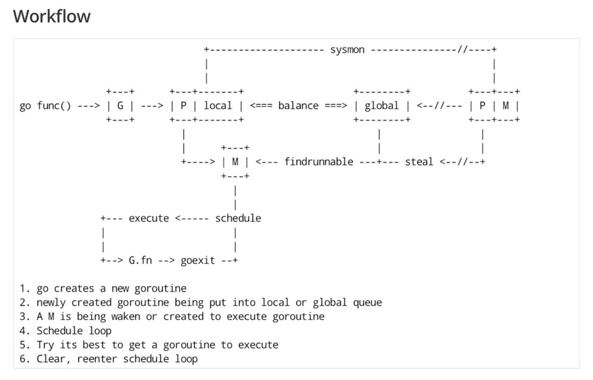

= 面试准备
:toc:
:sectnums:

== 技术问题
=== 网络
.OSI七层模型
1. 应用层. 应用级. 如 http/ftp/pop3(邮件), 针对不同软件的不同协议.
2. 表示层. 数据格式转换. 如 ssl/tls.
3. 会话层. 建立/管理/维护/关闭通信连接, 如 rpc.
4. 传输层. 管理两个节点间的数据传输. 有 tcp/udp.
5. 网络层. 地址管理和路由选择. 如 IP/ICMP.
6. 链路层. 物理层面上互联节点之间数据的传送. 如 PPP.
7. 物理层. 将数据的 0/1 转换为 高低电平或脉冲信号.

==== HTTP2
https://developers.google.com/web/fundamentals/performance/http2?hl=zh-cn

.架构
. 数据流：已建立的连接内的双向字节流，可以承载一条或多条消息。
. 消息：与逻辑请求或响应消息对应的完整的一系列帧。
. 帧：HTTP/2 通信的最小单位，每个帧都包含帧头，至少也会标识出当前帧所属的数据流。

.关系
. 所有通信都在一个 TCP 连接上完成，此连接可以承载任意数量的双向数据流。
. 每个数据流都有一个唯一的标识符和可选的优先级信息，用于承载双向消息。
. 每条消息都是一条逻辑 HTTP 消息（例如请求或响应），包含一个或多个帧。
. 帧是最小的通信单位，承载着特定类型的数据，例如 HTTP 标头、消息负载等等。 来自不同数据流的帧可以交错发送，然后再根据每个帧头的数据流标识符重新组装。

消息是最小的逻辑交互单位, 即 Request/Response 都是基于消息交互, 消息由 header/data Frames 组成.
但是一次物理通信最小的单位是帧, C/S 发送数据最小的单位是帧. 如一个消息有多个 data Frame, C/S 每次通信发一个 Frame, C/S 端会整理 data Frame.

===== http/sse
sse 是指 websocket 等技术

http 是基于浏览器层面考虑的, sse 是基于应用程序层面考虑的.

js 可以控制sse, 但不能控制http.

sse 底层是基于 http 的.

==== rpc
rpc即远程服务调用, 是一个概念/技术规范. grpc是一种实现, http+restful也可以视为一种实现.

.rpc主要由如下模块组成
1. 服务治理.
2. 数据传输格式, 序列化与反序列化.
3. 通信协议. http2/socket/tcp/udp
  .. udp不支持可靠传输, 使用udp时需要rpc框架作出相应处理.
4. 异常处理

.关于http和rpc
1. http也可以视为远程服务调用的一种, 解决两个应用之间的相互调用. 此时, 相较于服务间直接http调用, rpc的优势在于
  .. rpc使用场景做了优化.
    .. rpc 支持服务治理(重启/扩容等), 连接池, 服务注册与发现, 负载均衡, 限流, 重试等功能.
    .. 使用上将路由接口化, 规范化.
  .. rpc的数据传输更高效. rpc改进了数据格式, 数据序列化, 相较于http报文更加简介. 如grpc的protobuf.
  .. http的优点: 可读性强, 使用广泛.
2. http也可以单纯作为rpc通讯协议的选择之一, 其他可选的协议还有 socket, tcp/udp等.
. tcp是传输层协议(第四层), http/rpc 都是应用层协议(五层模型). 在七层模型中, rpc是会话层, http是应用层.

===== grpc
grpc底层使用 http2 作为通信传输协议, 但相较于直接使用http, grpc的protobuf格式与序列化/反序列化技术更为高效, 以及作为rpc功能更丰富.

grpc 本身不支持负载均衡/服务发现, 但是预留了相关接口. 可以通过 etcd/envoy 等技术实现类似功能

.protobuf
1. 优点: 序列化/反序列化快(具体源码未研究), 向后兼容, 二进制框架, 带压缩功能, 支持http2.
2. 缺点: 不是http. 表象来看就是, 可视化, 浏览器友好, 阅读友好等.

=== 负载均衡
1. Load Banlance Proxy 模式. 代理模式, 由指定节点实现负载均衡. 该类节点可能是由特定设计的机器承担的.
2. Client Load Banlance. 客户端负责负载均衡策略.

=== slice
切片数据结构
{
  byte*     array;      // actual data,                   指针 指向数组的某个位置
  uintgo    len;        // number of elements,            表示从指针指向位置 向后取多少个元素
  uintgo    cap;        // allocated number of elements,  表示该数组的最大长度
}

slice步长 -> 新slice 是在原数组/slice(地址) 上取一段地址, 不会发生拷贝, 开辟新地址等操作.

数组/切片区别:
1. 数组是值类型, 切片是引用类型.
2. 数组初始化时确定长度, 后续不可更改.
3. array 的长度是Type的一部分, 即 [10]int 与 [20]int 是不同的.

=== map
1. hash方法. 追求目的: 减少碰撞, 完美分配key.
2. 存储结构: 将hash值分散到连续地址上.
  .. hash冲突常用解决方法: 冲突元素置于一个数组中, map查找时先找到地址, 然后遍历List.

.hash函数常用思想
1. 求模.
  .. 一般使用素数求模, 因为素数求模相比合数碰撞更小.
2. 位操作配合其他方式. 具体方法不再讨论.

.map key 遍历无序的原因
1. 当map扩容时, map的key会重新进行hash, 如此遍历时顺序肯定发生变化.
2. go1.0 之后, map key 遍历时, 会添加一个随机数, 从随机位置开始遍历, 所以每次遍历起始位置不同, 顺序也自然不同. 不过相对顺序还是一致的, 如 `0-1-2 -> 1-2-0` (遍历内存地址顺序)

=== chanel
https://juejin.im/post/6844903821349502990

chanel 数据结构
{
  // chanel信息
  etype // 元素类型
  buf // 环形缓冲区
  dataqsiz // 缓冲区大小
  closed  // 是否关闭
  // 缓冲区/生产/消费者信息
  sendX/recvX // 发送/接收位置指针,
  sendq/recvq // 发送者等待组, 接收者等待组(链表)
  // 并发管理
  lock // 锁
}

.流程
1. 正常非阻塞流程. send时, 加锁, 从goroutinue copy 到环形缓冲区, recv时, 加锁copy到goroutinue.
2. 当G1发送消息时, 如果缓冲区已满, 则主动调用Go调度器(gopark函数), G1出让资源, 开始等待, 同时G1转换为sudog保存到sendq中等待被唤醒.
  .. 当G2读取消息时, 缓冲区有空位置, 从sendq中唤醒G1, 并将G1放入可执行队列.
3. 当因为没有消息, 消费者阻塞时, 生产者新生产的消息会直接拷贝到 阻塞消费者 的指定地址上(sudog包含该地址), 从而避免chanel锁.

1. 阻塞:
  .. 对于无缓冲区的chan, 只有写入的元素直到被读取后才能继续写入, 否则就一直阻塞.
  .. 对于有缓冲的chan,只有当缓冲满了, 才会阻塞
2. 可以使用 range 或 v,ok<-ch 的方式判断chanel是否关闭.
3. 向已关闭的chanel发送消息会panic, 但是可以从关闭的chanel中读取消息.

.如何优雅的关闭chanel
1. 关闭原则:
  .. 关闭前先检查chanel是否已经关闭
  .. 原则上从生产者端关闭chanel.
2. 使用Once关闭chanel
  func(mc *AStruct) SafeClose() {
    mc.once.Do(func() {
  		close(mc.C)
  	})
  }
3. 单生产者只需在生产端关闭即可. 单消费者可以通过发送信号给生产者来决定是否关闭chanel.
  多生产者/消费者 则需要引入协调者, 通过协调者关闭chanel(某一节点任务完成后通知协调者, 当全部完成则close)

.并发模型. 当并发编程普及后, 基于 锁+内存通信 的并发编程容易出错(如死锁), 容易降低性能. 后续诞生了 CSP/Actor 两种并发编程模型.
1. CSP 通信顺序模型. 基于消息交互控制. 如Go中 goroutine+chanel 实现的并发控制模型, 通过消息交互数据, 实现控制.
2. Actor 参与者. 一切 每个 Actor 有唯一地址, 进行数据通信, 实现并发控制.
. 参考: https://cloud.tencent.com/developer/article/1349213

=== gin/net/http
1. 性能提升: 框架相较于原生 net/http 包, 路由管理性能提升很大.
2. 功能提升: 中间件, 返回数据reader, context参数, bind方法等.

.gin/iris/echo 等选择
1. 功能/用法类似, 具体没有深入研究过. 速度也差不了多少. iris 据说功能更全面, gin路由更强, echo更简单. 具体选型还是看团队原有框架吧, 或者选一个自己喜欢, 顺手的.

.路由匹配
1. 思想: 使用树的方式, 采取前缀匹配(包含 完全匹配/模糊匹配/正则匹配(可选) 几种模式)
2. iris 使用 muxie 库实现, 具体没有研究.

=== GMP
https://www.cnblogs.com/sunsky303/p/9705727.html

https://juejin.im/post/6844904034449489933

G: Goroutinue, 任务对象, 进程控制块的抽象. 包括上下文信息, 现场恢复所需的寄存器信息.
M: Machine, 抽象线程. 在用户态运行, 与内核线程对应. 执行时切换到G的寄存器/堆栈信息
P: Processer, 抽象处理器. P负责调度协程, 与CPU核对应. P与M绑定形成计算单元.

P一般与系统核数相同, M一般多于P(因为M会出现休眠/阻塞等情况).

GMP 并发高效的原因
1. GMP调度方式, 设计
2. 避免陷入内核态. 与多线程相比, G保存了执行时的上下文数据, M执行时只需更换寄存器地址指向即可, 而多线程需要在内核态更改寄存器数据.

P队列:
1. 本地队列. 无锁, 更高效
2. 全局队列. 有锁, 用于不同的P之间负载均衡任务.
3. 本地队列和全局队列会自动进行任务均衡.

1. 函数执行时创建G, 将其绑定到P上, 如果P本地队列满则放到全局队列
2. 唤醒或从全局队列获取或创建M, 与P绑定, 开始执行G.
3. 进度调度循环: 获取G->执行->清理(goexit)->执行新的G
4. 当本地队列执行完毕, 则从全局队列获取G.

1. 当G阻塞时(如产生了系统调用), 解绑PM, 将剩余的G和P转移到其他M上执行.当阻塞M执行完毕时, 会尝试获取P, 如果没有获取到, 则G会放到全局队列中.
2. 当某个P/M上所有G执行完毕, 全局队列又没有空闲G时, 会从其他队列中偷取G. 一般是一半.

抢占式调用P
1. runtime.main 会创建一个额外线程运行 sysmon 函数.
2. sysmon函数会无限循环(休眠时间由 20us->10ms)

==== goroutine
1. 一个 goroutine 大小约为 2kb, 其他语言的thread约为1M左右.
2. goroutine 更简单, 更易于管理.

=== kafka
kafka结构: Producer brokers, Brokers, Consumer Group brokers, zookeeper集群.

kafka 通过 zookeeper 实现集群管理.

分区以文件夹形式存储数据, 分区有索引加快检索.

kafka保证单Partition内消费是有序的, 多Partition消费不一定是有序的(如果要保证多partition有序, 则p1阻塞后, p2也会阻塞(要有序), 会影响kafka的吞吐性).

.kafka 消息分区策略
1. 发送函数签名 kafka.send(topic, partition, key).
2. 如果指定partition, 则发送到指定patition.
3. 如果key为null, 则根据topic名获取上次计算分区时使用的一个整数并加一取模.
4. 如果key不为null, 则根据key hash值选择分区.

.当要求消费顺序时.
1. 只创建一个Partition. 但此时kafka高吞吐量的优势无法很好的体现.
2. 当多个Partition时, 同一组业务数据设置相同的key, kafka会将相同key的数据放入一个partition. 如用户的一次购买过程.
3. 借助订单状态, 将消息与数据对比, 状态正确则处理, 不正确则扔回延迟队列(适合基本有序的数据, 无序程度太高不合适)

pravega 大数据流式存储
pulsar 大数据 流批统一 消息队列, bookeeper 存储海量数据且高效(分层)

=== epoll
https://www.cnblogs.com/aspirant/p/9166944.html

epoll是Linux内核的可扩展I/O事件通知机制, 让需要大量操作文件描述符的程序得以发挥更优异的性能.

典型使用场景是 redis/nginx, 这些场景下通常有海量客户端与服务器保持连接, 但是每一时刻通常只有几百几千个活跃连接, 很需要使用I/O复用提升效率.

.I/O 事件通知机制有如下几种实现
1. 忙查询. 当阻塞时, 线程隔一段事件扫描一次所有I/O事件.
2. select 无差别查询. 当I/O事件发生, 轮询所有监听的事件.
3. epoll. 当I/O事件发生时, 同时知道那些事件发生了, 只轮询发生I/O的事件.

epoll解决I/O多路复用的问题. I/O多路复用就通过一种机制, 可以监视多个描述符, 一旦某个描述符就绪(一般是读就绪或者写就绪), 能够通知程序进行相应的读写操作.

Linux 原来使用select处理I/O事件通知, 当事件发生时, select轮询所有监听的I/O事件, 复杂度O(N).
epoll 只监听其中发生事件的 I/O通知, 复杂度为 O(K) 或 O(1)

1. epoll 在epoll_ctl函数(create)中, 创建时就会把所有的fd拷贝进内核, 而select是在每次调用时, 都会发生将fd集合由用户态拷贝到内核态.
2. epoll 为每个fd指定一个回调函数, 实现具体的会掉通知. select/poll 通过监听文件描述符实现.
3. select 由于单个进程能够监听的文件描述符有最大限制(系统可调), 且select使用轮询, 所以监听句柄有上限. 而epoll则无此限制.

=== 分布式事务方案
尽量避免分布式事务.

1. Mysql XA 事务
2. RocketMQ 事务消息
3. 事件补偿+超时回滚机制. 如 order/payment 分布式事务处理, 使用 消息补偿+超时关单 方式保证事务, 通过订单状态确定事务状态.

=== GC
.GC思想
1. 追踪式垃圾回收. 判断对象是否可达, 一旦发现不可达则标记为删除.
2. 引用计数法. 当引用计数为0时标记为回收. 可能出现循环引用, 每次赋值需要增加计数.

https://segmentfault.com/a/1190000022030353

.追踪式垃圾回收
1. Mark-And-Sweep. 设置标记位记录对象是否可达. 最开始所有都是0, 如果发现可达则置为1(即是否被指向). 遍历所有变量, 构建可达树, 标记完成后, 标记为0的则会被删除.
2. 三色标记(Go现在使用).

.三色标记. 需要STW
1. 使用三种颜色标记对象. 开始所有对象都是白色.
2. 将全局变量和函数栈内的对象标记为灰色.
3. 将灰色对象置为黑色, 将原来指向灰色变量的变量置为灰色.
4. 重复第三步, 直到发现没有对象可以置为灰色, 剩余的白色变量则是不可达变量.

.Go1.8后 三色标记+混合读写屏障, 无需STW.
1. GC开始&执行时, 将全局变量和在栈上的变量(包括新创建)置为黑色.

.问题
1. 已标记黑色的对象可能重新变得不可达, 如协程结束, 内存被清理, 或局部变量作用域结束.
2. 程序执行标记时, 如果不 STW, 可能出现新创建的对象没有被标记为黑色的情况.

.GC触发
1. 手动触发
2. 定量. 分配的内存到达一定值
3. 定时.

=== context
关闭方法: ctx.Done(), ctx.WithCanel() 返回canel方法

WithValue, WithDeadLine(时间点关闭), WithTimeOut() 时间间隔后关闭.

WithValue() -> calueCtx, 结构
{
  Context // Context, 所以直接可以取其字段, 包括k/v.
  key,value interface{}   // WithValue/Value() 写/取值时, 会判断key是否comparable(即是否可以被当作key)
}

=== HLL
HyperLogLog redis 基数计数算法.

标准误差 0.81, 通常使用多次HLL算法减小误差. 数据越随机, 试验次数越多(即数据量越大), 准确性越高.

具体原理参考 自己写的博客.

=== gorm
. DB, gorm对数据库的抽象. 负责与用户交互, 以及与数据库交互.
. Scope, 构建查询条件(Conditions), 执行SQL, 调起回调函数.
. CallBack, 负责CURD具体的执行逻辑. 具体的Conditions处理, db交互
  通过 Scope 执行的.

gorm(Go Object Relational Mapping, Go 对象关系映射).

=== mysql
ACID 原子性, 一致性, 隔离性, 持久性

隔离性问题: 脏读, 不可重复读, 幻读. 对应解决方法如下.
隔离性级别: 未提交读, 提交读, 可重复读, 串行化

.分库分表
. 横向划分: 我们一般是根据时间划分, 因为时间的局部性, 我们根据时间横向划分. 也可以根据某些字段hash划分.
. 纵向划分: 拆分表结构. 一般都是在划分业务时, 按业务拆分好, 我们现有业务中没有这么做.
. 分库: 不同业务划分不同数据库, 减少数据库压力. 同业务根据情况决定.

.引擎
. InnoDB Mysql默认引擎, 支持事务, 优先考虑. 适合查询/插入/更新都很多的情况.
. MyISAM 不支持事务, 无主键, 适合查询很多的情况.

=== 内存对齐
字段的不同排列方式可能造成所占大小不同.
起因是底层架构中, 内存对齐的原因. 内存对齐是为了加快访问, 一般采用2的指数次方对齐.
起因是 内存访问远远低于CPU周期, 造价也低于计算资源.

内存对齐是指CPU对内存的对齐访问, 所谓对齐访问, 包括两个方面: 起始位置+对齐字节值.
起始位置规则如下: 如果 sizeof(type)==N, 那么起始位置要能被N整除.
- 当访问1byte的数据时, 起始位置要能被1整除(就是有空闲就可以放)
- 当访问2byte的数据时, 起始位置要能被2整除
- 当访问4byte的数据时, 起始位置要能被4整除

对齐字节值规则如下(C语言, Go也适用):
1. 数据成员对齐规则:
    - 如果该成员是自带类型如int, char, double等, 那么 `内存对齐参数 = 该类型在内存中所占的字节数`
    - 如果该成员是自定义类型(如struct), 那么 `内存对齐参数 = 该类型内内存对齐参数最大的成员`
    - 如果自行设置了 内存对齐参数=i字节, 类中最大成员内存对齐参数为j, 那么 `内存对齐参数 = min(i, j)`
2. 整体对齐规则: 在数据成员完成各自对齐之后, 自定义类型(如struct)本身也要进行对齐. 整体内存对齐参数是 **内存对齐参数的k倍.**
    - 重点在 整体内存对齐参数的值, 而不是k的值. 之所以是k倍, 是因为结构体中类型数量和位置是不确定的, 所以k也是不确定的. 具体看后续介绍
3. 类中第一个数据成员放在offset为0的位置; 对于其他的数据成员(假设该数据成员内存对齐参数为k), 他们放置的起始位置offset应该是 `min(k,n)` 的整数倍

注意, 这里再次强调下内存对齐是为了保证CPU用最少的内存访问次数读取对象的值.

没有对齐时, 一次访问可能需要两次读取. 非对齐存储时, 一个数据可能存在两行上(offset发生变化), 则需要多一次读取.
.举例: 假设要读取2byte的数据 `int16类型`
 - 假设内存对齐: 只要 `startAddr%2==0` 即可. 如起始地址为 0x00, 那么16bit只需要从0x00连续读取16位即可.
 - 假设内存没有对齐
  - 如果 `startAddr/16<=1`, 既数据在同一offset内, 则一次读取也可以读出全部值
  - 如果 `startAddr/16>1`, 假设起始地址是0x18H(十进制24), 所以第一个字节存储在 offset为0的 A3, 最后一个字节存储在A0, 但是偏移量不同. 又因为offset只能是4的倍数, 所以第一次读取offset=0的 (A0-A3), 第二次读取 offset=1的 (A0-A3)', 然后拼接两段值得到2byte数据.

=== 缓存
缓存穿透. 恶意访问或非法id造成, 无数次击穿缓存访问数据库.

缓存雪崩. 缓存集体失效.

.缓存设置经验
1. 程序访问具有局部性. 空间局部性和时间局部性. 一个被访问的位置很可能被再次访问(缓存设置), 相邻的地址也可能被访问(底层设计, 高速/低速缓冲器).

LRU: 最远最少使用.
redis LRU 不是完全LRU的, 而是随机选择一定大小的块, 按LRU规则筛选. 可配置.

=== Go内存原理

=== 内存管理
.流程
1. 从系统申请一大块地址, 目的是减少系统调用的次数.
2. 将申请到的内存按特定大小切分为小块, 构成链表. 一般按照8的倍数切分. 为对象分配内存时, 只需从链表中取出一段即可.
3. 回收对象时, 直接将内存归还给链表
4. 闲置内存过多时, go尝试将内存归还给系统.

.内存块分类
1. span: 多个地址连续的页组成, 大块内存, go内部管理.
2. object, 将span切分为小块内存后的链表, 每个小块存储一个对象.

.内存分配器
1. cache: 每个线程绑定一个cache. 无锁分配, 线程私有, 保证线程高效.
2. central: 为所有cache提供span资源. 负责均衡各cache的object资源.
3. heap: 管理闲置span, 负责向系统申请内存. 负责均衡不同规格的span.

为何使用虚拟地址?::
  内存分配和GC回收都需要连续地址(如分配时都是 起始地址+长度), 虚拟地址可以保证这一点.

----
页所属 span 指针数组   GC 标记位图         用户内存分配区域
+-----------------+-------------------+---------------------------------------+
| spans 512MB     | bitmap 32GB       | arena 512GB                           |
+-----------------+-------------------+---------------------------------------+
spans_mapped         bitmap_mapped     arena_start   arena_used      arena_end
----

== 项目相关
=== 储值业务设计
.储值业务划分
1. 核心功能: 储值, 消费, 退款. Order
2. 支付服务. Payment
3. 商户/用户服务. 商户信息, 储值规则, 收银员信息等.
4. 增值服务. 添加到微信卡包, 微信模板消息, 邮件等.
5. 数据统计. 对账服务, 统计服务等.

.支付的可靠性
1. 支付流程的可靠性. 由于Order/Payment分别属于两个服务, 所以需要事务. 我们主要通过两个措施保证一致性.
  .. 重试和消息补偿. 当消息消费失败, 会将其加载到延迟队列, 重新消费, 有些服务则是另起协程, 一般是每 1/5/10s 重试, 全部失败则通知关单.
  .. 超时关单. 业务方负责超时检测. 将消息放入延迟队列(chanel或消息队列), 当订单超时时触发关单操作.
2. 对账检查. 保底措施, 通过对账检测数据的正确性.

一致性其他实现参考: https://cloud.tencent.com/developer/article/1041507

.服务可用性
1. 监控+日志. CPU/内存/消息队列 超额/异常报警, mysql慢任务统计.
2. 数据灾备, 服务异地多活, 主从数据库.
3. grpc+etcd 实现服务自动注册, 自动负载均衡, k8s 自动扩容.
4. 降级. 通过etcd配置某些功能降级. 暂时未实现自动熔断.
5. 使用缓存减少数据库压力, 重要数据启动时预加载到缓存, 缓存/数据库双写

=== 数据统计设计
1. go+kafka 流式计算
2. spark+hive 等

.丢单检查
1. 检查订单是否存在
  .. 主要通过 桶+map 实现, 首先将第三方数据加载到缓存, 然后流式读取内部订单数据对比.
  .. 考虑到 map 的hash规则, 一般使用 订单号前缀或时间戳分桶.
  .. 如果三方数据是流式的, 则可以使用流式的方式处理, 更加简单.
2. 检查金额是否一致
3. 检查总金额是否一致.

== 算法
=== ip地址查找
某一地址段指向同一个域名信息

数组二分法+map查找

=== 二维矩阵顺时针排序
.主要是两个判断
1. 结束条件判断.
2. 遍历时路径判断.

func(){
  mini,minj,maxi,maxj:= 0,0,len(a[0]),len(a)
  ok1 := mini!=maxi
  ok2 := minj!=maxj
  for ok1 || ok2{
    cacl(...)
    if mini<maxi{
      mini++
      maxi--
    }
    if minj<maxj{
      minj++
      maxj--
    }
  }
}
func cacl(maxi,maxj,mini,minj){
  i,j:=mini,minj
  for i++;i<maxi+1{
  }
  for j++;j<maxj+1{
  }
  for i--;i>mini{
  }
  for j--;j>minj{
  }
}

借助 i+(x) 的实现. x 每次变向实现 正向/逆向 循环, 如此只需两个游标即可, 无需四个. 具体不再考虑.

func(){
  mini,minj,maxi,maxj:= 0,0,len(a[0]),len(a)
  ok1 := mini!=maxi
  ok2 := minj!=maxj
  for ok1 || ok2{
    cacl2(...,1)
    cacl2(...,-1)
    if mini<maxi{
      mini++
      maxi--
    }
    if minj<maxj{
      minj++
      maxj--
    }
  }
}
func cacl2(maxi,maxj,minj,minj,x){
  i,j:=mini,minj
  for i+x;i<maxi+1&&j>0{
  }
  for j+x;j<maxj+1&&j>0{
  }
}

em.. 看起来还是以一圈的方式更加高效
